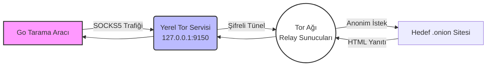

# 🛡️ Go Tor Scraper & CTI İstihbarat Aracı

Bu proje, **Siber Tehdit İstihbaratı (CTI)** süreçlerinde anonim ağlar (Tor) üzerindeki hedeflerden veri toplamak ve analiz etmek amacıyla **Go (Golang)** dili ile geliştirilmiştir.

Proje, özellikle **"Kritik Kütüphane Kısıtlamaları"** (sadece Standart Kütüphane ve x/net/proxy kullanımı) göz önünde bulundurularak, harici bir "Headless Browser" kullanılmadan **HTML Kaynak Kodu Analizi** yöntemiyle veri toplayacak şekilde tasarlanmıştır.

## 🚀 Özellikler

* **Tor Ağı Entegrasyonu:** Tüm trafik SOCKS5 protokolü üzerinden yerel Tor servisine (127.0.0.1:9150) tünellenir.
* **HTML Kaynak Arşivleme:** Hedef `.onion` sitelerinin kaynak kodlarını indirir ve analiz için saklar.
* **Hata Toleransı (Fault Tolerance):** Kapanan veya erişilemeyen sitelerde program çökmez, hatayı loglar ve sonraki hedefe geçer.
* **SSL/TLS Atlatma:** Self-signed sertifikaya sahip onion sitelerine erişim için güvenlik kontrolleri (`InsecureSkipVerify`) yapılandırılmıştır.
* **OpSec & Gizlilik:** `User-Agent` manipülasyonu ile isteklerin normal bir tarayıcıdan (Firefox/Windows) geldiği izlenimi verilir.

## 📊 Sistem Mimarisi

Uygulama, yerel makinede çalışan Tor servisi üzerinden şifreli bir tünel oluşturarak hedeflere ulaşır.



## 🛠️ Gereksinimler

* **Go:** 1.20 veya üzeri sürüm.
* **Tor Browser:** Arka planda çalışır durumda olmalıdır (Port 9150).

## 📦 Kurulum

Projeyi klonlayın ve gerekli proxy modülünü indirin:

```bash
git clone [https://github.com/KULLANICI_ADIN/Go-Tor-Scraper-CTI.git](https://github.com/ardaky/Go-Tor-Scraper-CTI.git)
cd Go-Tor-Scraper-CTI
go mod tidy
```

## 💻 Kullanım

1. **Tor Browser**'ı açın ve bağlandığından emin olun (Arka planda açık kalsın).
2. `targets.yaml` dosyasına taramak istediğiniz `.onion` adreslerini ekleyin.
3. Aracı çalıştırın:

```bash
go run main.go
```

## 📂 Çıktı ve Log Yapısı

Tarama tamamlandığında proje klasöründe aşağıdaki yapı oluşur:

```text
/Proje_Dizini
│
├── targets.yaml            # Hedef URL listesi
├── scan_report.log         # Başarılı/Başarısız durum özeti
├── error.log               # Detaylı hata kayıtları
│
└── /sonuclar               # İndirilen HTML dosyaları
    ├── darknet...html
    └── dready...html
```

---

